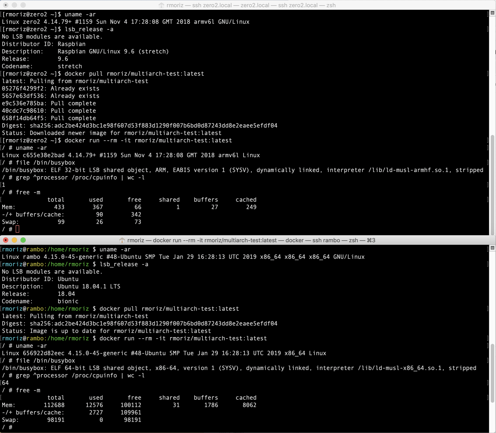

# Let Docker Hub build your multi-arch images (autobuild)

## How?

- enable autobuild (build on Github webhook) in repository settings on Docker Hub.
- read, copy and adjust contents of the `hooks` directory and Dockerfile.

See also: https://docs.docker.com/docker-hub/builds/advanced/
